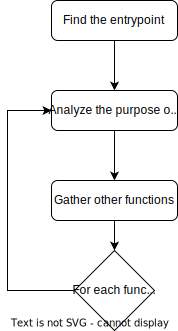
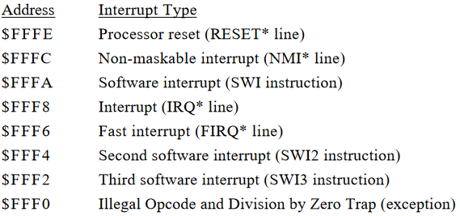

# An overview of the CP3501, the control unit of a wideband microwave receiver

## Abstract

In my latest blog post, I invite you to join me on an intriguing journey into the core of the CP3501, the control unit of a wideband microwave receiver. Thanks to the generosity of my chief, I gained access to the CP3501's ROM, allowing me to embark on a comprehensive journey of reverse engineering. Together, we will unravel the complexities of this cutting-edge equipment, sharing the discoveries I've made, insights into its intricate software architecture, and a wealth of technical details that have surfaced during my exploration. Whether you're an experienced engineer or simply curious about microwave receiver systems, this blog post could interests you.

## Thanks

I'd like to express my gratitude to Bertrand Velle, my supervisor, for guiding me through this exploration and providing me with the ROM.

## Content

- [An overview of the CP3501, the control unit of a wideband microwave receiver](#an-overview-of-the-cp3501-the-control-unit-of-a-wideband-microwave-receiver)
  - [Abstract](#abstract)
  - [Thanks](#thanks)
  - [Content](#content)
  - [Abbreviations](#abbreviations)
  - [Introduction](#introduction)
  - [Recognition](#recognition)
    - [CP3501 specifications](#cp3501-specifications)
    - [Pictures analysis](#pictures-analysis)
      - [HD63B09EP](#hd63b09ep)
      - [HM6264LP-12](#hm6264lp-12)
      - [R65C22P2](#r65c22p2)
      - [R65C52J2](#r65c52j2)
      - [Other components](#other-components)
      - [Trace the PCB traces connecting the components](#trace-the-pcb-traces-connecting-the-components)
  - [ROM analysis](#rom-analysis)
    - [General informations](#general-informations)
    - [Entrypoint](#entrypoint)
    - [After the entrypoint](#after-the-entrypoint)
    - [Environment initialization](#environment-initialization)
    - [Main loop](#main-loop)
    - [Communication protocol](#communication-protocol)
      - [Format](#format)
      - [Some mapping](#some-mapping)
    - [Bulk details](#bulk-details)
  - [Conclusion](#conclusion)
  - [References](#references)


## Abbreviations

- ABI  : Application Binary Interface
- FIRQ : Fast IRQ
- IRQ  : Interrupt ReQuest
- ISA  : Instruction Set Architecture
- MPU  : MicroProcessor Unit
- VIA  : Versatile Interface Adapter

## Introduction

In this blog post, we'll delve into the CP3501 engine, which serves as a control unit for a wideband microwave receiver called the SMR3522B. If you're interested in getting a hardware overview of these two pieces of equipment, you can check out these informative blog posts:

- For details on the CP3501: http://rxcontrol.free.fr/Receivers/MACOM/CP3501/
- To learn more about the SMR3522: http://rxcontrol.free.fr/Receivers/MACOM/SMR3522/

To help you grasp the concept of the engine we're about to reverse engineer, refer to the following diagram.


## Recognition

In this section, we will gather information from various sources unrelated to the ROM. We will start by examining the document that details CP3501 capabilities and then proceed to analyze the images provided via the previously shared link.

### CP3501 specifications

From [this link](https://vertassets.blob.core.windows.net/download/b167730f/b167730f-aa7e-405b-84b0-2db8b43a17b6/cp-3801.pdf), you can gather some interesting information, including:

- Alphanumeric display of 4 lines, 20 characters each.
- 12 keys, including 11 dual-function keys.
- 1 optical encoder.
- RS-422 serial line.
- "Once the receiver has executed a command, it sends information back to the controller for display to the user."
- "Menus are provided for bandwidth selection, video output levels, demodulation, mode, BIT, and communication information."

### Pictures analysis


#### HD63B09EP

The only visible microprocessor is the HD63B09EP, which is an 8-bit processor manufactured by Hitachi. According to the Wikipedia page, it is a clone of another processor known as the Motorola 6809. You can readily access the datasheet and the Instruction Set Architecture (ISA) for the HD63B09EP online. This information will be essential for comprehending key aspects of the ROM analysis.

#### HM6264LP-12

This component is 8x8192 words RAM memory.

#### R65C22P2

This is a VIA, which enables the microprocessor to interface with other peripherals. We will examine the ROM to identify the connected devices.

#### R65C52J2

This component serves as the interface between the serial line and the microprocessor. It is of utmost importance to identify the software configuration of this interface in order to trace the data transmitted along the serial line between the control unit and the microwave receiver.

#### Other components

Many other small components are present in the system, but they may not be particularly relevant to our focus. For instance, there are components designed to facilitate the interaction between the hardware of the serial pins and the R65C52J2.

#### Trace the PCB traces connecting the components

Originally, I had intended to follow the traces on the PCB to gain insight into how the components interface with the MPU. However, my tutor advised me to minimize my reliance on the visual cues provided by the images. Consequently, I chose not to use this method as extensively.

## ROM analysis

To analyze this ROM, I will use the following methodology :



### General informations

I use Ghidra as a framework to analyze the ROM. The H6309 processor doesn't have as many features as, for example, the X64 processor, especially in terms of ABI recognition. The recognition of this ABI is closely tied to the compiler used, but we lack specific information in our context. Ghidra only provides the default compiler specification, so for each function analysis, there's a significant amount of work involved in identifying the correct ABI. Furthermore, the stack introspection module is not functioning optimally. Stack arguments are not retrieved accurately, and some returns from functions are also not properly identified. For instance, if a `pop` instruction for the instruction pointer register occurs at the end of a function, it is not recognized as a `ret` from a function, even though it is semantically equivalent.

### Entrypoint

The ROM is a 32 kiB binary file. After a bit of MPU datasheet analysis, we can determine that the memory mapping is the following :



Hence, it can be inferred that the memory address 0xfffe must store a pointer to the reset vector, which is executed every time the MPU is powered on. Since our ROM file is limited to 32 KiB in size, we will position it at the end of the 64 KiB address space. The architecture follows a big-endian format, allowing us to read the gathered reset vector pointer directly from left to right. Consequently, the reset vector points to 0xcf39.

Now, we can proceed with the analysis. The purpose of this function can be summarized in pseudo-C code as follows:

```c
void RESET_VECTOR(void) {
  // Load some data from addresses and do one store
  // Set the stack pointer to 0x1fff

  char *jmp_vector_table = 0x09a3;
  for(int i=0; i<18; i+=3) {
    jmp_vector_table[i]   = 0x7e;
    jmp_vector_table[i+1] = 0xcf;
    jmp_vector_table[i+2] = 0x67;
  }

  func_0xa59b();
  
  while(true) {}
}
```

As we can observe, there's a loop that iterates six times, starting from address 0x09a3 and incrementing by 3 each time. During each iteration, the memory value is set to 0x7ecf67. It's reasonable to assume that this loop is responsible for setting the pointers for other vector interrupt routines, as all the vector interrupts appear to be mapped to one of the values set in this loop. The only exceptions are the reset vector and the FIRQ, which seem to be hardcoded to 0x7ecf67, corresponding to the assembled instruction `jmp 0xcf67`. The address 0xcf67 appears to correspond to a function that primarily consists of jumping to the reset vector infinite loop. The FIRQ hardcoded pointer is pointing to a function mainly jumping to the same function as the other interruptions. To conclude, the only used interruption vector is the reset vector.

### After the entrypoint

Before the infinite loop found in the reset vector, there's a call to another function. This function primarily performs three tasks:

1. Clearing the RAM from address 0x000 to 0x9c2.
2. Initializing the environment.
3. Starting the main loop.

### Environment initialization

The environment initialization section accomplishes several tasks:

- It configures non-default interruption vectors for software interruption, the second software interruption, and the FIRQ.
- It establishes default configurations for the R65C52J2 and R65C22P2 components.
- It initializes various variables, including buffers and strings.
- It retrieves presets from the receiver, which is noteworthy due to a receiver-specific feature that saves certain configurations as presets.

### Main loop

This function essentially governs the state machine. The pseudo-C++ code representation can be expressed as follows:

```c
struct callback_match {
  char to_match[2];
  void (*callback)(string);
}

struct callback_match CALLBACKS[51] = {
  // All callbacks are defined here
}

string STR_CURRENT_COMMAND_ANSWER = "";

void main_loop(void) {
  while(true) {
    disable_irq_and_firq();
    char from_serial = get_from_serial();
    serial_ack();
    enable_irq_and_firq();
    STR_CURRENT_COMMAND_ANSWER += from_serial;

    if(from_serial == ';' || from_serial == ']') {
      jump_to_callback(STR_CURRENT_COMMAND_ANSWER);
      STR_CURRENT_COMMAND_ANSWER = "";
    }
  }
}

void jump_to_callback(string command) {
  for(int i=0; i<51; i++) {
    if(command[0:2] == CALLBACKS[i].to_match) {
      CALLBACKS[i].callback(command);
      return;
    }
  }
  CALLBACKS[50].callback(command);
}
```

As evident, the system possesses a high degree of flexibility owing to the callback array. Now that we've pinpointed all the `callback_match` structures, we can proceed with the analysis of the callback functions to uncover the intent behind the responses transmitted by the microwave receiver.

### Communication protocol

A custom protocol is in use for communication over the serial line. This protocol has been tailored to facilitate the transmission of multiple commands simultaneously.

#### Format

The format of protocol requests is the following :

```
[X<port>C01<commands>]
```

With :

- port     : a two digit number representing the port (example `01`)
- commands : a list of semicolon commands (example `BAZ;GS?`)

And the answers are formatted like :

```
<command><answer>
```

With :

- command : The command answered by this string
- answer  : Custom format for each command code

#### Some mapping

| Command | Answer format | Answer description                 |
|---------|---------------|------------------------------------|
| F0      | F0 ab.cdefghi | Center frequency ab.cdefghi in Ghz | 
| D0      | D0 ab.cdefghi | Center frequency ab.cdefghi in Ghz | 
| I0      | I0 ab.cdefghi | Center frequency ab.cdefghi in Ghz | 
| F1      | F1 ab.cdefghi | Start frequency ab.cdefghi in Ghz  | 
| D1      | D1 ab.cdefghi | Start frequency ab.cdefghi in Ghz  | 
| I1      | I1 ab.cdefghi | Start frequency ab.cdefghi in Ghz  | 
| F2      | F2 ab.cdefghi | Stop frequency ab.cdefghi in Ghz   | 
| D2      | D2 ab.cdefghi | Stop frequency ab.cdefghi in Ghz   | 
| I2      | I2 ab.cdefghi | Stop frequency ab.cdefghi in Ghz   | 
| ST      | ST abc        | Sweep time abc in ms               |
| BW      | BW abcde      | Bandwith abcde in Mhz              |
|         | ERabc         | Specify an error code abc          |

### Bulk details

- The serial line can be RS-232, RS-422 or an IEEE488
- Many string operations
- 32 bit mathematical related functions
- Table mapping each ASCII character with its specificities (is it representing a number, a printable char...)
- Preset configuration and management

## Conclusion

It has truly been a pleasure exploring the intricacies of this unique engine together! The process of reverse engineering this well-structured ROM has been a gratifying journey. I've identified fascinating patterns, including the state machine, 32-bit mathematical operations, and the setup of external peripherals. If you're interested in delving even deeper into this ROM, you can download my Ghidra database for this project and enhance or refine it as needed. Additionally, you can visit my tutor's blog post for further analysis methodologies and a wealth of images related to this device.

## References

- http://rxcontrol.free.fr/Receivers/MACOM/CP3501/
- http://rxcontrol.free.fr/Receivers/MACOM/SMR3522/
- https://vertassets.blob.core.windows.net/download/b167730f/b167730f-aa7e-405b-84b0-2db8b43a17b6/cp-3801.pdf
- https://en.wikipedia.org/wiki/Hitachi_6309
- https://en.wikipedia.org/wiki/MOS_Technology_6522